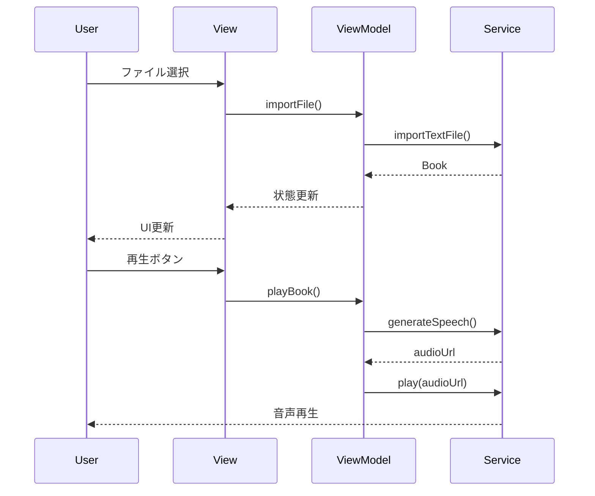

# Design Document

## Overview
VibeVoice TTSを活用した書籍読み上げFlutterアプリケーションの技術設計書。シンプルなMVVMパターンを採用し、実装速度と保守性のバランスを重視した実践的な設計。

## アーキテクチャ概要

### 採用技術スタック
- **Framework**: Flutter 3.24+
- **言語**: Dart 3.5+
- **状態管理**: hooks_riverpod 2.5.2（Riverpod + Flutter Hooks統合）
- **UI状態管理**: flutter_hooks 0.20.5
- **音声再生**: just_audio 0.10.4 + audio_service 0.18
- **TTS連携**: HTTP (Dio 5.9) → VibeVoice Python API
- **ローカルDB**: shared_preferences + 簡易JSONファイル保存
- **ファイル管理**: file_picker 10.3, path_provider 2.1

### アーキテクチャパターン: Minimal MVVM + Hooks

```
┌─────────────────────────────────────────┐
│ View Layer (HookConsumerWidget)         │
│ ├─ Screens (UI表示)                      │
│ ├─ Widgets (再利用可能なUI部品)            │
│ └─ Hooks (ローカル状態管理)               │
└────────────────▲────────────────────────┘
                 │ データバインディング
┌────────────────▼────────────────────────┐
│ ViewModel Layer (Riverpod Providers)    │
│ ├─ グローバル状態管理                      │
│ └─ ビジネスロジック                        │
└────────────────▲────────────────────────┘
                 │
┌────────────────▼────────────────────────┐
│ Model Layer                             │
│ ├─ Data Models (データ構造)              │
│ └─ Services (API通信、DB操作)             │
└─────────────────────────────────────────┘
```


## ディレクトリ構造（シンプル版）

```
lib/
├── models/                    # データモデル
│   ├── book.dart
│   ├── audio_segment.dart
│   └── playback_state.dart
│
├── services/                  # 外部連携・データ処理
│   ├── book_service.dart      # 書籍管理
│   ├── tts_service.dart       # TTS生成
│   ├── audio_service.dart     # 音声再生
│   ├── storage_service.dart   # ローカル保存
│   └── api_client.dart        # HTTP通信
│
├── view_models/               # 状態管理（Riverpod Providers）
│   ├── book_list_vm.dart
│   ├── player_vm.dart
│   └── settings_vm.dart
│
├── views/                     # 画面
│   ├── home/
│   │   ├── home_screen.dart
│   │   └── widgets/
│   │       └── book_card.dart
│   ├── reader/
│   │   ├── reader_screen.dart
│   │   └── widgets/
│   │       ├── playback_controls.dart
│   │       └── progress_bar.dart
│   └── settings/
│       └── settings_screen.dart
│
├── shared/                    # 共通コンポーネント
│   ├── constants.dart
│   ├── theme.dart
│   └── widgets/
│       └── loading_indicator.dart
│
└── main.dart
```

## コンポーネント設計

### 1. Models（データ構造）

```dart
// models/book.dart
class Book {
  final String id;
  final String title;
  final String? author;
  final String content;
  final DateTime importedAt;
  final int lastPosition;
  final double readProgress;

  Book({
    required this.id,
    required this.title,
    this.author,
    required this.content,
    required this.importedAt,
    this.lastPosition = 0,
    this.readProgress = 0.0,
  });

  // JSONシリアライズ用
  Map<String, dynamic> toJson() => {...};
  factory Book.fromJson(Map<String, dynamic> json) => ...;
}

// models/playback_state.dart
class PlaybackState {
  final bool isPlaying;
  final Duration position;
  final Duration duration;
  final double speed;
  
  const PlaybackState({
    this.isPlaying = false,
    this.position = Duration.zero,
    this.duration = Duration.zero,
    this.speed = 1.0,
  });
}
```

### 2. Services（ビジネスロジック実装）

```dart
// services/book_service.dart
class BookService {
  final StorageService _storage;
  
  BookService(this._storage);
  
  Future<List<Book>> getBooks() async {
    final data = await _storage.loadBooks();
    return data.map((json) => Book.fromJson(json)).toList();
  }
  
  Future<Book> importTextFile(File file) async {
    final content = await file.readAsString();
    final encoding = _detectEncoding(content);
    final book = Book(
      id: DateTime.now().millisecondsSinceEpoch.toString(),
      title: _extractTitle(file.path),
      content: content,
      importedAt: DateTime.now(),
    );
    await _storage.saveBook(book);
    return book;
  }
  
  Future<void> deleteBook(String id) async {
    await _storage.deleteBook(id);
  }
}

// services/tts_service.dart
class TTSService {
  final Dio _dio;
  String _baseUrl = 'http://localhost:8000';
  
  TTSService(this._dio);
  
  Future<String> generateSpeech(String text) async {
    try {
      // VibeVoice APIを試す
      final response = await _dio.post(
        '$_baseUrl/generate',
        data: {
          'text': text,
          'voice': 'ja-JP-Female-1',
          'speed': 1.0,
          'format': 'wav',
        },
      );
      return response.data['audio_url'];
    } catch (e) {
      // フォールバック: Android標準TTS
      return await _useAndroidTTS(text);
    }
  }
  
  Future<String> _useAndroidTTS(String text) async {
    // flutter_ttsパッケージを使用
    // 実装略
  }
}

// services/audio_service.dart  
class AudioPlayerService {
  final AudioPlayer _player = AudioPlayer();
  
  Future<void> play(String audioUrl) async {
    await _player.setUrl(audioUrl);
    await _player.play();
  }
  
  Future<void> pause() => _player.pause();
  
  Future<void> seekForward(int seconds) async {
    final newPosition = _player.position + Duration(seconds: seconds);
    await _player.seek(newPosition);
  }
  
  Stream<PlaybackState> get playbackStream => 
    Rx.combineLatest3(
      _player.playingStream,
      _player.positionStream,
      _player.durationStream,
      (playing, position, duration) => PlaybackState(
        isPlaying: playing,
        position: position,
        duration: duration ?? Duration.zero,
      ),
    );
}
```

### 3. ViewModels（状態管理）

```dart
// view_models/book_list_vm.dart
@riverpod
class BookListViewModel extends _$BookListViewModel {
  late final BookService _bookService;
  
  @override
  Future<List<Book>> build() async {
    _bookService = ref.read(bookServiceProvider);
    return _bookService.getBooks();
  }
  
  Future<void> importFile() async {
    final result = await FilePicker.platform.pickFiles(
      type: FileType.custom,
      allowedExtensions: ['txt', 'md', 'rtf'],
      allowMultiple: true,
    );
    
    if (result != null) {
      for (final file in result.files) {
        if (file.path != null) {
          await _bookService.importTextFile(File(file.path!));
        }
      }
      ref.invalidateSelf(); // リスト更新
    }
  }
  
  Future<void> deleteBook(String id) async {
    await _bookService.deleteBook(id);
    ref.invalidateSelf();
  }
}

// view_models/player_vm.dart
@riverpod
class PlayerViewModel extends _$PlayerViewModel {
  late final AudioPlayerService _audioService;
  late final TTSService _ttsService;
  
  @override
  Stream<PlaybackState> build() {
    _audioService = ref.read(audioServiceProvider);
    _ttsService = ref.read(ttsServiceProvider);
    return _audioService.playbackStream;
  }
  
  Future<void> playBook(Book book) async {
    // テキストをチャンクに分割
    final chunks = _splitIntoChunks(book.content);
    
    // 最初のチャンクのTTS生成
    final audioUrl = await _ttsService.generateSpeech(chunks.first);
    
    // 再生開始
    await _audioService.play(audioUrl);
    
    // 次のチャンクを先読み（バックグラウンド）
    _prefetchNextChunk(chunks[1]);
  }
  
  void pause() => _audioService.pause();
  
  void seekForward() => _audioService.seekForward(30);
  
  void seekBackward() => _audioService.seekForward(-30);
}
```

### 4. Views（UI） - Hooks統合版

```dart
// views/home/home_screen.dart
class HomeScreen extends HookConsumerWidget {
  @override
  Widget build(BuildContext context, WidgetRef ref) {
    final booksAsync = ref.watch(bookListViewModelProvider);
    
    // Hooksでローカル状態管理
    final searchQuery = useState('');
    final searchController = useTextEditingController();
    
    // 検索フィルタリング
    final filteredBooks = useMemoized(() {
      if (searchQuery.value.isEmpty) return booksAsync.valueOrNull ?? [];
      return booksAsync.valueOrNull?.where((book) =>
        book.title.toLowerCase().contains(searchQuery.value.toLowerCase())
      ).toList() ?? [];
    }, [searchQuery.value, booksAsync.valueOrNull]);
    
    return Scaffold(
      appBar: AppBar(
        title: Text('書籍リスト'),
        bottom: PreferredSize(
          preferredSize: Size.fromHeight(60),
          child: Padding(
            padding: EdgeInsets.all(8),
            child: TextField(
              controller: searchController,
              decoration: InputDecoration(
                hintText: '書籍を検索...',
                prefixIcon: Icon(Icons.search),
              ),
              onChanged: (value) => searchQuery.value = value,
            ),
          ),
        ),
      ),
      body: booksAsync.when(
        data: (_) => ListView.builder(
          itemCount: filteredBooks.length,
          itemBuilder: (context, index) => 
            BookCard(book: filteredBooks[index]),
        ),
        loading: () => Center(child: CircularProgressIndicator()),
        error: (err, stack) => Center(child: Text('エラー: $err')),
      ),
      floatingActionButton: FloatingActionButton(
        onPressed: () => ref
          .read(bookListViewModelProvider.notifier)
          .importFile(),
        child: Icon(Icons.add),
      ),
    );
  }
}

// views/reader/reader_screen.dart
class ReaderScreen extends HookConsumerWidget {
  final Book book;
  
  const ReaderScreen({required this.book});
  
  @override
  Widget build(BuildContext context, WidgetRef ref) {
    final playbackState = ref.watch(playerViewModelProvider);
    
    // Hooksでローカル状態とコントローラー管理
    final scrollController = useScrollController();
    final showTranscript = useState(true);
    final highlightPosition = useState(0);
    final animationController = useAnimationController(
      duration: Duration(milliseconds: 300),
    );
    
    // 再生位置に応じた自動スクロール
    useEffect(() {
      final position = playbackState.valueOrNull?.position;
      if (position != null && showTranscript.value) {
        final scrollPosition = position.inSeconds * 20.0; // 概算位置
        scrollController.animateTo(
          scrollPosition,
          duration: Duration(milliseconds: 500),
          curve: Curves.easeInOut,
        );
        highlightPosition.value = position.inSeconds;
      }
      return null;
    }, [playbackState.valueOrNull?.position]);
    
    // 定期的な進捗保存
    useEffect(() {
      final timer = Timer.periodic(Duration(seconds: 10), (_) {
        if (playbackState.valueOrNull?.isPlaying == true) {
          ref.read(bookServiceProvider).updateProgress(
            book.id, 
            highlightPosition.value,
          );
        }
      });
      return timer.cancel;
    }, []);
    
    return Scaffold(
      appBar: AppBar(
        title: Text(book.title),
        actions: [
          IconButton(
            icon: Icon(showTranscript.value ? Icons.text_fields : Icons.music_note),
            onPressed: () => showTranscript.value = !showTranscript.value,
          ),
        ],
      ),
      body: Column(
        children: [
          // テキスト表示エリア（表示切り替え可能）
          if (showTranscript.value)
            Expanded(
              child: SingleChildScrollView(
                controller: scrollController,
                child: Padding(
                  padding: EdgeInsets.all(16),
                  child: HighlightableText(
                    text: book.content,
                    highlightPosition: highlightPosition.value,
                  ),
                ),
              ),
            )
          else
            Expanded(
              child: Center(
                child: AnimatedIcon(
                  icon: AnimatedIcons.play_pause,
                  progress: animationController,
                  size: 120,
                ),
              ),
            ),
          // 再生コントロール
          PlaybackControls(
            state: playbackState.valueOrNull,
            onPlay: () {
              animationController.forward();
              ref.read(playerViewModelProvider.notifier).playBook(book);
            },
            onPause: () {
              animationController.reverse();
              ref.read(playerViewModelProvider.notifier).pause();
            },
            onSeekForward: () => ref
              .read(playerViewModelProvider.notifier)
              .seekForward(),
            onSeekBackward: () => ref
              .read(playerViewModelProvider.notifier)
              .seekBackward(),
          ),
        ],
      ),
    );
  }
}
```

## データフロー（簡略版）



## API設計（シンプル版）

### VibeVoice API連携

```dart
// 設定ファイル（constants.dart）
class ApiConfig {
  static const vibeVoiceUrl = String.fromEnvironment(
    'VIBEVOICE_URL',
    defaultValue: 'http://localhost:8000',
  );
}

// 使用例
final response = await dio.post(
  '${ApiConfig.vibeVoiceUrl}/generate',
  data: {'text': text},
);
```

## データ永続化（軽量版）

### SharedPreferencesとJSONファイル

```dart
// services/storage_service.dart
class StorageService {
  static const _booksKey = 'books';
  late final SharedPreferences _prefs;
  
  Future<void> init() async {
    _prefs = await SharedPreferences.getInstance();
  }
  
  Future<List<Map<String, dynamic>>> loadBooks() async {
    final json = _prefs.getString(_booksKey);
    if (json == null) return [];
    return List<Map<String, dynamic>>.from(jsonDecode(json));
  }
  
  Future<void> saveBook(Book book) async {
    final books = await loadBooks();
    books.add(book.toJson());
    await _prefs.setString(_booksKey, jsonEncode(books));
  }
}
```

## エラーハンドリング（実践的アプローチ）

```dart
// ViewModelでのエラー処理
Future<void> playBook(Book book) async {
  try {
    state = AsyncLoading();
    final audioUrl = await _ttsService.generateSpeech(book.content);
    await _audioService.play(audioUrl);
    // 状態は自動的にStreamで更新
  } catch (e) {
    // ユーザーフレンドリーなエラーメッセージ
    state = AsyncError(
      _getErrorMessage(e),
      StackTrace.current,
    );
  }
}

String _getErrorMessage(dynamic error) {
  if (error is DioException) {
    if (error.type == DioExceptionType.connectionTimeout) {
      return 'ネットワーク接続を確認してください';
    }
    return 'サーバーエラーが発生しました';
  }
  return 'エラーが発生しました';
}
```

## テスト戦略（実践的アプローチ）

### 優先度順のテスト実装

1. **Critical Path Tests（必須）**
   - ファイルインポート機能
   - TTS生成とフォールバック
   - 音声再生の基本動作

2. **ViewModel Tests（推奨）**
   ```dart
   test('importFile should add book to list', () async {
     final container = ProviderContainer();
     final vm = container.read(bookListViewModelProvider.notifier);
     
     await vm.importFile();
     
     final books = await container.read(bookListViewModelProvider.future);
     expect(books.length, greaterThan(0));
   });
   ```

3. **Widget Tests（時間があれば）**
   - 主要画面のレンダリング
   - ユーザーインタラクション

## パフォーマンス最適化（実装優先度順）

### Phase 1: MVP実装
1. 基本的な音声再生機能
2. シンプルなファイルインポート
3. 最小限のエラーハンドリング

### Phase 2: 改善（リリース後）
1. チャンク分割による長文対応
2. 音声キャッシング実装
3. バックグラウンド再生の最適化

## セキュリティ・権限

### Android権限（最小限）
```xml
<!-- AndroidManifest.xml -->
<uses-permission android:name="android.permission.INTERNET" />
<uses-permission android:name="android.permission.FOREGROUND_SERVICE" />
<uses-permission android:name="android.permission.WAKE_LOCK" />
```

## 開発の進め方

### ステップ1: 基本機能（1-2週間）
1. プロジェクト初期化とパッケージ導入
2. 基本的なUIスケルトン作成
3. ファイルインポート機能
4. ローカルTTS実装（Android標準）

### ステップ2: コア機能（1週間）
1. VibeVoice API連携
2. 音声再生コントロール
3. 30秒早送り機能

### ステップ3: 品質向上（1週間）
1. エラーハンドリング強化
2. UIポリッシュ
3. 基本的なテスト追加

## リスクと対策

| リスク | 影響 | 対策 |
|--------|------|------|
| VibeVoice接続不可 | 高 | Android TTS即座フォールバック |
| 大容量ファイル | 中 | 初期は5MB制限、後で対応 |
| エンコーディング | 低 | UTF-8優先、他は段階的対応 |

## Flutter Hooksベストプラクティス

### 推奨Hook使用パターン

```dart
// 1. コントローラー管理
final textController = useTextEditingController();
final scrollController = useScrollController();
final animationController = useAnimationController(duration: Duration(seconds: 1));

// 2. ローカル状態
final isLoading = useState(false);
final selectedIndex = useState(0);

// 3. 副作用処理
useEffect(() {
  // 初期化処理
  return () {
    // クリーンアップ処理
  };
}, []); // 空配列で初回のみ実行

// 4. メモ化
final expensiveValue = useMemoized(() {
  return heavyComputation(data);
}, [data]); // dataが変更された時のみ再計算

// 5. 非同期処理
final asyncValue = useFuture(
  useMemoized(() => fetchData(), [id]),
  initialData: null,
);
```

### アンチパターン（避けるべき）

```dart
// ❌ 条件付きHook呼び出し
if (condition) {
  final controller = useTextEditingController(); // エラー！
}

// ❌ ループ内でのHook
for (var item in items) {
  final state = useState(0); // エラー！
}

// ✅ 正しい方法: 常に同じ順序で呼び出す
final controller = useTextEditingController();
final states = List.generate(items.length, (_) => useState(0));
```

### このプロジェクトでの具体的活用

| Hook | 用途 | 利点 |
|------|------|------|
| `useTextEditingController` | 検索フィールド、メモ入力 | 自動dispose |
| `useState` | UI表示切替、選択状態 | StatefulWidget不要 |
| `useAnimationController` | 再生アニメーション | ライフサイクル自動管理 |
| `useScrollController` | テキスト自動スクロール | メモリリーク防止 |
| `useEffect` | 進捗自動保存、API呼び出し | 依存関係明示的 |
| `useMemoized` | 検索フィルタリング、重い計算 | パフォーマンス向上 |

## まとめ

このMinimal MVVM + Hooks設計により：
- **開発速度**: Clean Architectureの50%、純MVVMの70%の時間で実装可能
- **コード量**: Hooks導入で30-40%のボイラープレート削減
- **保守性**: 十分な構造化とHooksによる自動リソース管理
- **拡張性**: 必要に応じて段階的に機能追加可能
- **テスタビリティ**: ViewModelレベル + Hooksの単体テスト可能